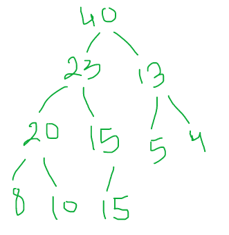
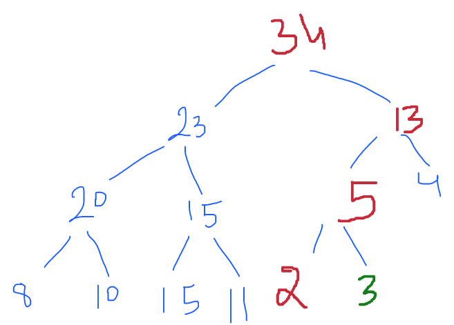
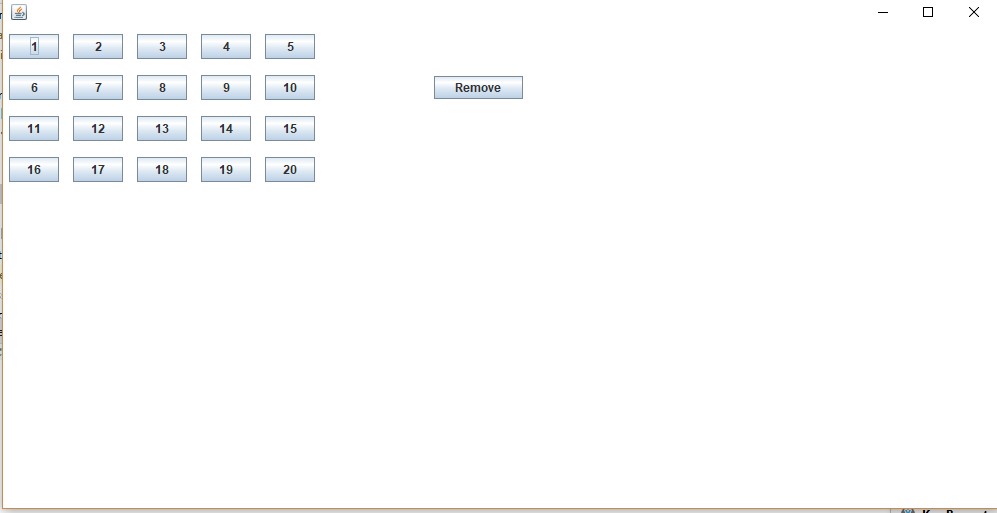
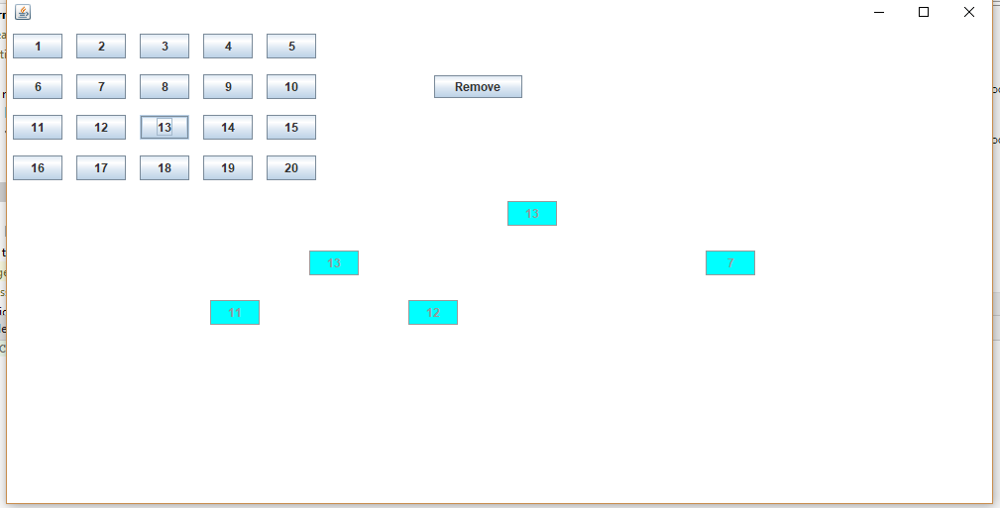
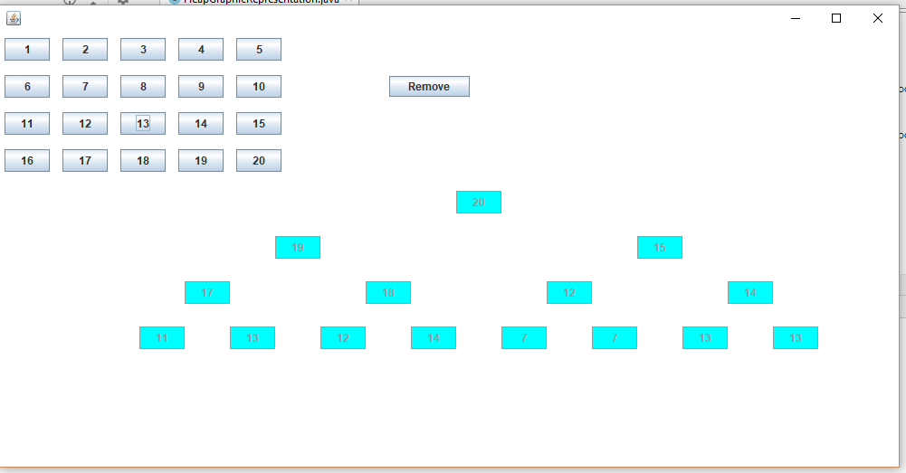
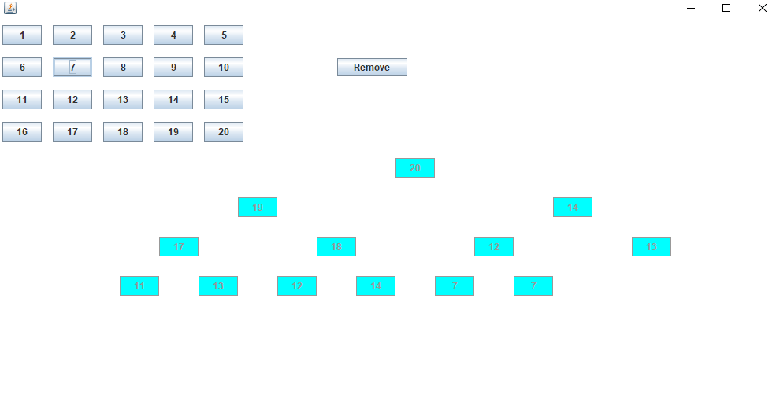

= *Heap*

        Heap
MAX-Heap	MIN-Heap

- MAX-heap: is a

* - complete binary tree

* - All descendants of a node must be smaller. i.e.
ROOT will be max

- MIN-heap: is a

* - complete binary tree

* - All descendants of a node must be greater. i.e. ROOT will be min

---
*Considerations*

* We are working on MAX-heap now.

* Array- Representation of HEAP: 1-based index

* if node is at index = i

* it's parent will be at = i / 2

* it's left child will be at = 2 * i

* it's right child will be at = 2 * i + 1

---

*PUSH*

[ 0 40 23 13 20 15 5 4 8 10 15 ]

*POP*

    Original Heap:

0 56 23 40 20 15 34 4 8 10 15 11 5 13 2 3

    1st pop:

0 40 23 34 20 15 13 4 8 10 15 11 5 3 2 0

    2nd pop:

0 34 23 13 20 15 5 4 8 10 15 11 2 3 0 0

---

Run `HeapGraphicRepresentation` class

java -cp learn-ds-0.0.1-SNAPSHOT.jar in.co.bytehub.ds.heap.HeapGraphicRepresentation

---
Insert Operation

---
Once Heap is Full

---

Remove Operation

